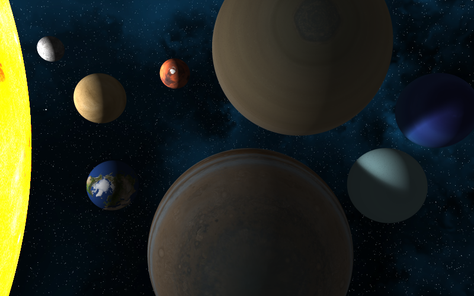

# Tracer

Simple distributed ray tracing 3D engine.

# Credit

## Ray Tracing

Mostly from "The Ray Tracer Challenge" book by Jamis Buck. Go buy that book, it's awesome.

## Textures and Sky Boxes

- http://www.humus.name/index.php?page=Textures
- http://planetpixelemporium.com/earth.html
- http://www.celestiamotherlode.net/catalog/earthbumpspec.php
- https://www.solarsystemscope.com/textures/
- http://wwwtyro.github.io/space-3d/
